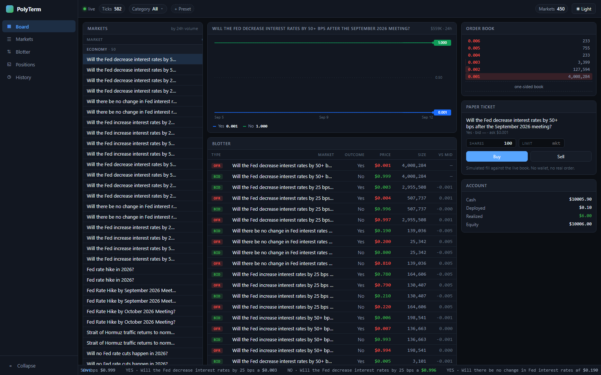

<div align="center">

# PolyTerm

**A live trading terminal for [Polymarket](https://polymarket.com) prediction markets.**
Every segment of the board, real-time prices, order-book depth, and paper trading that
settles when markets resolve.

No wallet. No API keys. No real orders — and no code path that could place one.

[](https://github.com/rajmaurya0904/polyterm/actions/workflows/ci.yml)




</div>

---

## Quick start

```bash
git clone https://github.com/rajmaurya0904/polyterm.git
cd polyterm
npm install
npm run dev
```

Open <http://localhost:5173>. That's it — no configuration, no account, no keys. Live data
starts flowing within a few seconds.

| Command | What it does |
| --- | --- |
| `npm run dev` | API on `:4010` and web on `:5173`, both hot-reloading |
| `npm run build` | Production build of the web app |
| `npm start` | Serve the built app from the API server, one process |
| `npm test` | Server test suite |
| `npm run typecheck` | Typecheck the web app |
| `npm run ci` | Everything CI runs, in one command |

## What you get

- **The whole board** — every Polymarket segment (economy, politics, crypto, sports, world,
  tech, science, culture, weather), busiest markets first within each, flashing on every tick
- **Order-book ladder** — depth bars, mid price, spread
- **Price history** — multi-series chart with crosshair and value pills; hand-rolled SVG, no chart library
- **Blotter** — top-of-book bid and offer lines with resting size, sortable by spread, size or volume
- **Paper trading** — orders filled against the *live* book, level by level, with real slippage
- **Settlement** — when a market resolves, positions pay out at $1.00 or $0.00 automatically
- **Search & watch** — pull any Polymarket market into the live feed
- **Presets & filters** — saved category views, faceted multi-select
- **Light / dark** — token-driven, persisted

### Pages

| Page | What's there |
| --- | --- |
| **Board** | Three-column terminal — quote grid, chart, blotter, depth ladder, ticket, account |
| **Markets** | Every watched market, plus search to add any Polymarket market to the feed |
| **Blotter** | Full-width two-sided quotes across every outcome, with a "tight only" filter |
| **Positions** | Stat tiles, mark-to-market, one-click close, settlement check, account reset |
| **History** | Trade log; expand any row to see the individual fills it walked |

## How it works

```
Polymarket public APIs
   Gamma  · segments (tagged events), metadata, resolution status
   CLOB   · bulk order books, price history
   WS     · live trade pushes
            │
            ▼
   server/  Node + Express + ws
            builds the segment universe, holds ONE upstream
            socket, bulk-polls books, simulates paper fills,
            settles resolved markets, fans state out
            │
            │  local WebSocket, one snapshot per second
            ▼
   web/     React + TypeScript + Vite
```

**How the board is chosen.** Polymarket has no category field; segments live as tags on an
*event*, and they overlap — the Fed decision is tagged Economy, Politics, Business and Finance
at once. So each market is claimed by the first segment that lists it, which makes SEGMENTS an
editorial order rather than an arbitrary one.

The outcome budget is then split **evenly**, not spent in priority order. Politics and Sports
alone offer several thousand outcomes between them; filling greedily buries everything else.
The first attempt did exactly that — nine segments went in, two came out with all 1,500 slots
and seven came back empty. Each segment now gets an equal share and only what it cannot use is
handed back to the others.

**Why it scales.** Two things keep a 450-outcome board as cheap as a 40-outcome one. Books are
fetched in bulk (`POST /books`, 250 tokens a request), so a refresh costs a couple of requests
rather than one per outcome. And the browser tells the relay which row is open, so only that row
and anything held carry a full ladder — everything else is sent top-of-book. Focusing a row adds
about 200 bytes to the snapshot, not 450 rows' worth of depth.

**Why a relay?** A browser cannot hold the exchange feed directly — page CSP and the exchange's
own origin rules both prevent it. One server-side socket also means ten open tabs cost the
upstream feed one connection, not ten.

**Why a socket *and* REST polling?** They carry different things. The socket delivers trades
immediately but only intermittent book snapshots, and its last-trade price can drift outside the
current spread on a fast market. REST is authoritative for depth. The UI treats bid/ask as truth
and marks a last price outside the spread as stale (`*`), because presenting a stale quote as live
is worse than showing nothing.

## Paper trading

Orders are filled locally by walking the live book, level by level, until filled or the limit is
crossed. A thin book produces real slippage — a 2,000-share order might consume seven price levels
and fill well above the best ask. Partial fills are reported rather than invented away.

**Settlement.** Every minute, each market you hold is asked whether the oracle has ruled. When it
has, each share pays **$1.00** on the winning outcome and **$0.00** on the rest, the position
closes, and the trade is recorded as `SETTLED` in History. Positions that resolved while the
server was offline settle at the next start. Two signals are required before a payout: the
market's `umaResolutionStatus` must be `resolved` *and* every outcome price must have collapsed
to exactly 0 or 1 — `closed` alone flips when trading halts, days before the ruling.

State lives in `data/paper.json`. Delete it, or hit **Reset account**, to start over.

What it deliberately does **not** model:

- **Queue position** — a limit fills instantly if the price is there; in reality you wait in line
- **Fees and gas**
- **Market impact** — the book doesn't react to your order

Fills are therefore optimistic. Direction, spread cost and resolution risk are realistic;
absolute returns flatter you.

### Reading the numbers

- Prices are probabilities from 0 to 1. `$0.190` means the market implies a 19% chance.
- Positions mark at **best bid** — your exit price — so a new position shows a loss immediately.
  That's the spread, not an error.
- A position that cannot be marked shows `—`, never `$0.00`, and is excluded from the total
  rather than silently counted as flat. It says *why*: `no bid` when the book is live but nobody
  is buying, `no book` when there is no book at all. Those are different facts and only the
  second is a fault.
- A closed market shows `awaiting ruling` until the oracle settles it.

## Configuration

Everything is optional.

| Variable | Default | Meaning |
| --- | --- | --- |
| `PORT` | `4010` | API / relay port |
| `HOST` | `127.0.0.1` | Bind address. Set `0.0.0.0` to expose on your LAN — there is no auth |
| `PER_SEGMENT` | `20` | Events pulled per segment at startup |
| `MAX_OUTCOMES` | `450` | Total outcome budget, split evenly across segments |
| `BOOK_REFRESH_MS` | `4000` | Order-book poll interval |
| `SETTLE_CHECK_MS` | `60000` | How often held markets are checked for resolution |
| `PROBE_PER_TICK` | `12` | Skipped outcomes re-checked individually per refresh |

## API

The web app is the only intended client, but the relay is plain HTTP + JSON if you want to
script against it.

| Method | Path | Purpose |
| --- | --- | --- |
| `GET` | `/api/state` | Full snapshot: rows, books, positions, account |
| `GET` | `/api/history/:tokenId?interval=1w` | Price series (`1h 6h 1d 1w 1m max`) |
| `GET` | `/api/search?q=` | Search Polymarket markets |
| `POST` | `/api/watch` | `{ marketId }` — add a market to the feed |
| `POST` | `/api/paper/order` | `{ tokenId, side, shares, limit? }` — paper fill |
| `GET` | `/api/paper/trades` | Trade log, newest first |
| `POST` | `/api/paper/settle` | Check held markets for resolution now |
| `POST` | `/api/paper/reset` | `{ balance? }` — wipe the paper account |
| `WS` | `/` | The same snapshot as `/api/state`, pushed every second. Send `{type:'focus',tokenId}` to get full depth on one row |

## Security

This project's whole premise is that it cannot lose you money, so the boundary is worth stating.

- **No signing.** There is no wallet library, no private-key path, and no call to Polymarket's
  authenticated trading API anywhere in the tree. `grep -r "PRIVATE_KEY\|@polymarket/clob-client"`
  returns nothing, and a PR that changes that will not be merged.
- **Loopback by default.** The relay has no authentication — anyone who can reach the port can
  move the paper account — so it binds `127.0.0.1` unless you set `HOST` yourself.
- **WebSocket origin check.** Browsers don't apply CORS to sockets. Without a check, any website
  open in the same browser could read your feed and positions; the relay refuses upgrades from
  foreign origins.
- **Every input validated** before it reaches an upstream URL: ids must be decimal strings,
  intervals come from a whitelist, balances have a range, and the watch set is capped so a loop of
  `/api/watch` calls can't turn into a request storm against the exchange.
- **Two runtime dependencies** (`express`, `ws`). CI fails on any high-severity advisory in them.

## Tests

```bash
npm test
```

94 tests on Node's built-in runner — no test framework, no new dependencies. They cover the
parts that *compute* rather than relay: the fill walker, position accounting, settlement,
segment allocation, and payload normalisation. Network code is deliberately not mocked; a mock of an endpoint proves only
that the mock matches your belief about it.

The suite is mutation-checked, not assumed good. Each of these turns it red:

| Mutation | Tests that fail |
| --- | --- |
| Partial fill invents liquidity | 6 |
| Settlement pays out but never records — double-pay | 6 |
| Settlement realized P/L computed from the wrong basis | 4 |
| Oversell guard removed | 2 |
| Float-dust epsilon removed from position netting | 1 |
| Trade ids revert to `Date.now()` | 1 |
| Limit comparison flipped | 1 |
| Sell reduces basis at the sale price | 1 |
| Staleness tolerance removed | 1 |
| Category regex loses word boundaries | 1 |
| Settlement trusts `umaResolutionStatus` alone | 1 |
| Settlement trusts collapsed prices alone | 1 |
| Settlement accepts a ruling with no winner | 1 |
| Settlement payout guard removed | 1 |
| Segment budget spent greedily instead of shared | 2 |
| Segment budget ceiling removed | 1 |
| Unused segment share never redistributed | 1 |
| A market claimed by two segments at once | 1 |
| One failing segment takes the whole board down | 1 |
| A one-sided book reported as no book | 1 |

Two of the first tests written passed against deliberately broken code and were rewritten. The
float-dust case had used a residue that happened to be exactly zero, and the id-collision case
depended on wall-clock timing — a disk write between orders was enough to make it pass against
the very bug it existed to catch. It now freezes the clock.

## Project layout

```
server/src/
  index.js       API, relay, snapshot assembly, settlement loop
  polymarket.js  segments & budget, endpoint access, normalisation,
                 resolution detection, quote state
  socket.js      upstream socket with backoff
  paper.js       fill simulation, position accounting, settlement
server/test/     paper.test.js · polymarket.test.js
web/src/
  App.tsx        shell, routing, board composition
  views/         Markets, Blotter, Positions, History
  components/    Panel, QuoteTable, Blotter, PriceChart,
                 DepthLadder, PaperPanel, Shell, Ticker
  hooks/         useLiveSnapshot, useTrades
  theme.css      design tokens
```

## Contributing

Issues and pull requests welcome. CI runs tests, typecheck and build on Node 20 and 22;
`npm run ci` runs the same thing locally.

Good first areas: more data adapters (Kalshi, Manifold), price alerts, saved layouts, a
queue-position model for limit orders.

Please keep the read-only guarantee intact — no signing, no private keys, no order submission.

## Disclaimer

For research and education. Not financial advice. Paper results do not predict real returns, for
all the reasons listed above and several more.

## License

MIT — see [LICENSE](LICENSE).
